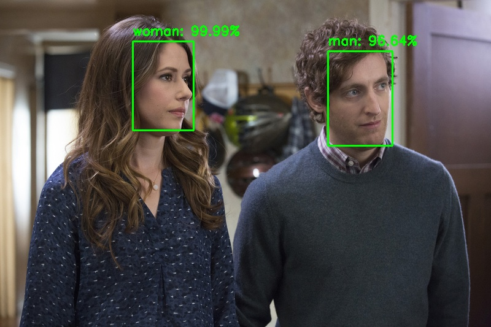

# Gender detection using deep learning models 
The keras model is created by training model from scratch on around 2200 face images (~1100 for each class). Face region is cropped by applying `face detection` using `cvlib` on the images gathered from Google Images. It acheived around 96% training accuracy and ~90% validation accuracy. (20% of the dataset is used for validation)

## Python packages used

* keras
* tensorflow
* numpy
* opencv-python
* cvlib
* scikit-learn
* matplotlib
* protobuf

Install the required packages by executing the following command.

`$ pip install -r requirements.txt`

**Note: Python 2.x is not supported** 

Make sure `pip` is linked to Python 3.x  (`pip -V` will display this info).

If `pip` is linked to Python 2.7. Use `pip3` instead. 
`pip3` can be installed using the command `sudo apt-get install python3-pip`

Using **Python virtual environment** is highly recommended.

## Usage

### image input
`$ python detect_gender.py -i <input_image>`

### webcam
`$ python detect_gender_webcam.py`

### Sample output :

## Training
You can download the dataset I gathered from Google Images from this [link](https://github.com/arunponnusamy/gender-detection-keras/releases/download/v0.1/gender_dataset_face.zip) and train the network from scratch on your own if you are interested. You can add more images and play with the hyper parameters to experiment different ideas. 
